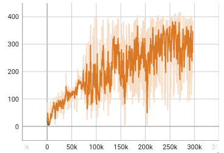

# PCWM-Jax

Unofficial reproduction of [PCWM](https://arxiv.org/pdf/2404.18926) (Point Cloud Models Improve Visual Robustness in Robotic Learners) based on original [DreamerV3](https://arxiv.org/pdf/2301.04104v1) implementation.

Currently tested on only the `LiftCube-v0` environment for training. 



To run this first install mani_skill2,

```
pip install mani_skill2
```

and run

```
python dreamerv3/train.py \
  --logdir ~/logdir/$(date "+%Y%m%d-%H%M%S") \
  --configs maniskill2_liftcube_pcwm
```

To visualize the results using tensorboard:

```
tensorboard --logdir ~/logdir --bind_all --port 1111
```

This repository is mainly based on the [DreamerV3](https://github.com/danijar/dreamerv3/tree/8fa35f83eee1ce7e10f3dee0b766587d0a713a60) implementation.
